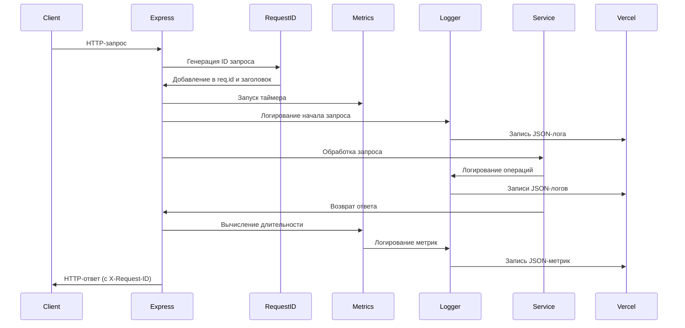

# Общий пакет (Shared)

## Usage

### Browser (mini-app, frontend)
```typescript
import { BotSchema, BotButton } from '@dialogue-constructor/shared/browser';
```

### Server (core, router)
```typescript
import { logger, middleware } from '@dialogue-constructor/shared/server';
// or
import { logger, middleware } from '@dialogue-constructor/shared';
```
Правило: любой browser-код (mini-app) импортирует только `@dialogue-constructor/shared/browser`.
Импорт из root (`@dialogue-constructor/shared`) и `@dialogue-constructor/shared/server` в mini-app запрещён.

Enforcement: ESLint `no-restricted-imports` в mini-app и CI `rg`-проверка.


## Использование логгера

### Базовое использование
const logger = createLogger('service-name');
logger.info('Message', { context });

### С контекстом запроса
const requestLogger = createChildLogger(logger, { requestId, userId });

### Уровни логирования
- error: Ошибки, требующие внимания
- warn: Предупреждения
- info: Информационные сообщения (по умолчанию)
- debug: Детальная отладочная информация

### Файлы логов и ротация (не для Vercel)
Включите ротацию JSON-логов в файл с помощью `LOG_TO_FILE=true` (опционально `LOG_FILE_PATH=logs/app.log`). Настройки ротации:
- `LOG_SIZE_MB` (по умолчанию 100)
- `LOG_INTERVAL` (по умолчанию 1d) - принимает 'daily', 'hourly', '1d', '1h' или миллисекунды
- `LOG_MAX_FILES` (по умолчанию 30)
- `LOG_COMPRESS` (true/false) - ⚠️ не поддерживается pino-roll, будет проигнорировано
Vercel использует только вывод JSON в stdout.

### Логирование метрик
logger.info('Operation completed', {
  metric: 'operation_name',
  duration: 123,
  success: true
});

## Диаграмма потока логирования



## Структура логов

| Компонент | Уровень | Контекст | Метрики |
|-----------|---------|----------|---------|
| HTTP-запрос | info | method, path, requestId, userId | duration, statusCode, bodySize |
| Запрос к БД | info | operation, table, requestId | duration, rowCount |
| Telegram API | info | method, chatId, botId | duration, success |
| Webhook | info | botId, userId, updateType | processingTime |
| Ошибка | error | requestId, userId, stack | errorType, errorCode |

## Webhook интеграции

### Формат payload
```json
{
  "bot_id": "uuid",
  "user_id": 123456,
  "state_key": "confirm_booking",
  "timestamp": "2026-01-27T12:00:00.000Z",
  "user": {
    "first_name": "Анна",
    "phone_number": "+79990001122",
    "email": "anna@example.com"
  },
  "context": {
    "previous_state": "collect_contact"
  }
}
```

### Пример Google Sheets (Apps Script)
```javascript
function doPost(e) {
  const sheet = SpreadsheetApp.getActiveSpreadsheet().getSheetByName('Лист1');
  const data = JSON.parse(e.postData.contents);
  sheet.appendRow([
    data.timestamp,
    data.user_id,
    data.user?.first_name || '',
    data.user?.phone_number || '',
    data.user?.email || ''
  ]);
  return ContentService.createTextOutput(JSON.stringify({ ok: true }))
    .setMimeType(ContentService.MimeType.JSON);
}
```

### Пример Telegram канала
Используйте Bot API `sendMessage`:
```
POST https://api.telegram.org/bot<token>/sendMessage
{
  "chat_id": "@channel_name",
  "text": "📩 Новая запись\n👤 {first_name}\n📱 {phone_number}\n📧 {email}"
}
```

### Рекомендации по безопасности
- Используйте только `https://` URL.
- Включайте подпись запроса через `X-Bot-Timestamp` и `X-Bot-Signature`.
- Проверяйте подпись на своей стороне (HMAC-SHA256 от `${timestamp}.${body}`).
- Ограничивайте домены через allowlist при необходимости.
