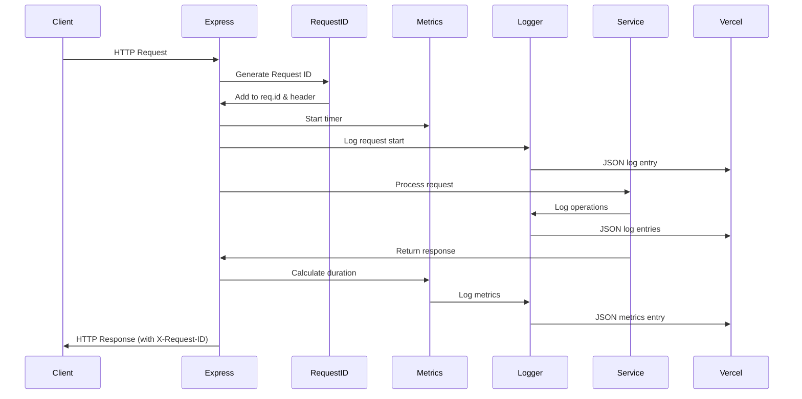

# Shared Package

## Logger Usage

### Basic usage
const logger = createLogger('service-name');
logger.info('Message', { context });

### With request context
const requestLogger = createChildLogger(logger, { requestId, userId });

### Log levels
- error: Ошибки, требующие внимания
- warn: Предупреждения
- info: Информационные сообщения (по умолчанию)
- debug: Детальная отладочная информация

### Log files and rotation (non-Vercel)
Enable rotating JSON logs to file with `LOG_TO_FILE=true` (optional `LOG_FILE_PATH=logs/app.log`). Rotation settings:
- `LOG_SIZE_MB` (default 100)
- `LOG_INTERVAL` (default 1d)
- `LOG_MAX_FILES` (default 30)
- `LOG_COMPRESS` (true/false)
Vercel stays JSON-to-stdout only.

### Metrics logging
logger.info('Operation completed', {
  metric: 'operation_name',
  duration: 123,
  success: true
});

## Диаграмма потока логирования

## Структура логов

| Компонент | Уровень | Контекст | Метрики |
|-----------|---------|----------|---------|
| HTTP Request | info | method, path, requestId, userId | duration, statusCode, bodySize |
| DB Query | info | operation, table, requestId | duration, rowCount |
| Telegram API | info | method, chatId, botId | duration, success |
| Webhook | info | botId, userId, updateType | processingTime |
| Error | error | requestId, userId, stack | errorType, errorCode |
